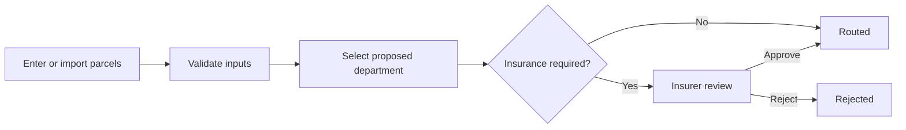

# ParcelDesk

- Parcel routing assignment built with **React, TypeScript, Express and SQLite**.
- Supports individual parcels, JSON/XML imports, insurance review and editable routing rules.
- SQLite keeps setup simple; this project does not use MongoDB.

## Quick start

- Install **Node.js 24**.
- Open a terminal in the repository folder containing `package.json`.

```sh
npm ci
npm run dev
```

- Open <http://127.0.0.1:5173>.
- Initial local demo login: **admin / Demo-admin-2026!**.
- Open **Account & access**; create an operator and an insurer with your chosen passwords.
- Fresh databases create only the admin. Existing accounts and changed passwords persist.
- Stop with **Ctrl+C**. Ctrl+Z suspends the server and may leave ports occupied.

### Other ways to run

| Mode             | Commands                                                              | Open                    |
| ---------------- | --------------------------------------------------------------------- | ----------------------- |
| Built local demo | `npm run build` then `npm run start:demo`                             | <http://127.0.0.1:8081> |
| Docker demo      | `docker compose -f compose.demo.yaml up`                              | <http://127.0.0.1:5173> |
| Production       | Configure credentials and HTTPS; see [Operations](docs/OPERATIONS.md) | Your configured domain  |

## Default rules

| Input              | Result                         |
| ------------------ | ------------------------------ |
| Weight ≤ 1 kg      | Mail                           |
| 1 < weight ≤ 10 kg | Regular                        |
| Weight > 10 kg     | Heavy                          |
| Value > €1000      | Await insurance before routing |



## Roles

| Role     | Main actions                                      | Theme  |
| -------- | ------------------------------------------------- | ------ |
| Operator | Enter parcels; preview and import batches         | Blue   |
| Insurer  | Approve or reject pending insurance               | Teal   |
| Admin    | Manage policies, staff accounts and audit records | Violet |

- Exactly one admin; multiple operators and insurers are allowed.
- Staff can sign in after the admin creates their account and initial password.
- Admin cannot approve insurance; permissions are enforced by the API.

## Try the sample files

- [Exploration JSON](examples/explore-batch.json): 12 parcels; **8 routed, 4 insurance holds** under default rules.
- [Mixed-validity JSON](examples/explore-partial-import.json): 2 valid rows and 3 invalid rows.
- [Assignment XML](examples/Container_68465468.xml): 17 parcels; **11 routed, 6 holds**. Confirm and enter `NL` as fallback country; the XML has no country field.
- Import flow: **Import a batch → Preview import → Confirm import**.
- Atomic mode saves nothing if a row is invalid; optional partial mode saves valid rows after preview.

```json
[
  {
    "reference": "ORDER-001",
    "weight": "2.500",
    "value": "1500.00",
    "country": "NL",
    "attributes": { "fragile": true }
  }
]
```

- Weight: positive, at most 100,000 kg, up to 3 decimal places.
- Value: €0–€1 billion, up to 2 decimal places.
- Country: two-letter ISO code. Reference and attributes are optional.
- Import limit: **2 MiB / 5,000 rows**. CSV export limit: **10,000 rows**.
- Attributes affect routing only when a matching rule exists.

## Main features

- Policy editor: ordered rules, conditions, parcel tester, saved tests and impact preview.
- Safe activation: reason required, stale previews rejected, failing saved tests block publication.
- Version history: rollback creates a new version; old parcel decisions remain unchanged.
- Department chart: new active departments appear at zero; retired departments keep dimmed historical counts.
- Batch history, row-level errors, filters, CSV exports and audit records.
- Exact decimal comparisons, transactional writes and retry protection.
- Protected metrics, health checks, backups and security workflows.

## Project layout

```text
client/src/        React views, forms and policy editor
server/
  routes/          HTTP endpoints and permissions
  services/        Intake, exports and monitoring
  repositories/    Database queries
  domain.ts        Validation and routing rules
  imports.ts       JSON/XML readers
shared/            TypeScript contracts
examples/          Import and policy samples
tests/             Backend, React and browser tests
scripts/           Backup, monitor and submission utilities
docs/              Design, API and usage guides
```

## Developer checks

```sh
npm run lint
npm run format:check
npm test
npm run test:ui
npm run test:coverage
npm run build
npx playwright install chromium
npm run test:e2e
npm run benchmark
```

- `npm run feature:demo`: run the local feature-branch-to-merge exercise.
- `npm run package`: build the submission ZIP without local databases or secrets.
- Backend coverage gates: 75% lines, 70% functions, 65% branches; startup file excluded.
- Benchmark measures bounded local processing, not production network performance.

## Documentation

| Guide                                              | Content                                              |
| -------------------------------------------------- | ---------------------------------------------------- |
| [Assignment](docs/ASSIGNMENT.md)                   | Original requirements, preserved unchanged           |
| [Feature walkthrough](docs/FEATURE_WALKTHROUGH.md) | Step-by-step demo with expected outcomes             |
| [Architecture](docs/ARCHITECTURE.md)               | Components, workflows and design trade-offs          |
| [API](docs/API.md)                                 | Routes, authentication and input contracts           |
| [Improvements](docs/IMPROVEMENTS.md)               | Delivered features and remaining work                |
| [Operations](docs/OPERATIONS.md)                   | Deployment, monitoring, recovery and troubleshooting |
| [AI usage](docs/AI_USAGE.md)                       | Contribution record, prompts and limitations         |
| [Presentation](docs/ParcelDesk-Presentation.pptx)  | Included presentation deck                           |

## Practical limits

- Designed for one Node process; SQLite work is synchronous and bounded.
- Policy impact preview covers at most the latest 5,000 inputs.
- Public deployment, external alert delivery and disaster recovery need environment-specific validation.
- Private-repository CodeQL scanning requires the owner's GitHub Code Security setup.
- Demo database: `data/demo-ts.sqlite3`; production default: `data/routing-ts.sqlite3`.
- Optional `.env` settings are listed in [.env.example](.env.example); never commit real credentials.
