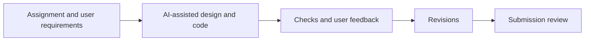

# AI usage record

## Contributions

| Area        | User contribution                                                               | AI assistance                                                              |
| ----------- | ------------------------------------------------------------------------------- | -------------------------------------------------------------------------- |
| Scope       | Supplied the assignment and requested a complete submission                     | Interpreted requirements and proposed implementation approaches            |
| Technology  | Requested React, TypeScript or MERN, plus usage documentation                   | Implemented React/TypeScript with Express and SQLite; explained trade-offs |
| Design      | Supplied requirements, feedback and requested improvements                      | Assisted with architecture, workflows and technical design decisions       |
| Development | Requested features and reported observed issues                                 | Generated and revised frontend, backend, tests and configuration           |
| Usability   | Requested role themes, editable policies and corrected department counts        | Implemented the UI changes and related behavior                            |
| Access      | Required one admin, admin-created staff and retention of existing demo accounts | Implemented account controls and persistence                               |
| Delivery    | Requested documentation cleanup and repository submission                       | Drafted guides and assisted with local checks and Git workflows            |

- This was an AI-assisted project, including design, coding, testing and documentation.
- The conversation does not establish that all architecture decisions were independently completed before AI involvement.
- AI-generated explanations and code still need review and understanding by the submitter.

## Prompts used

| Prompt excerpt                                                                                      | Purpose                                |
| --------------------------------------------------------------------------------------------------- | -------------------------------------- |
| “complete this project ... after project completion, create a detailed interview preparation guide” | Initial implementation and explanation |
| “code should be in react, typescripte, or use mern stack, and readme file, about how to use”        | Stack and setup instructions           |
| “continue prev task and add these top 5 improvements”                                               | Review-driven revisions                |
| “i was not able to crete/remove/edit new policy”                                                    | Improve policy management              |
| “Keep the existing demo accounts”                                                                   | Preserve existing staff access         |

## Revisions made during development

| Earlier approach or issue                         | Resulting change                                             | Reason                                               |
| ------------------------------------------------- | ------------------------------------------------------------ | ---------------------------------------------------- |
| Basic weight-band configuration                   | Ordered conditions and a final catch-all                     | Support new routing needs without editing core logic |
| Policy impact was visible but editing was unclear | Structured editor, parcel tester and activation controls     | Make rule changes usable and reviewable              |
| Batch validation lacked a complete review flow    | Preview, optional partial import and row error reports       | Explain outcomes before saving                       |
| Department rename left the chart confusing        | Active zero-count departments and dimmed retired departments | Preserve history while showing current policy        |
| Shared demo roles were insufficient               | Admin-created named staff accounts                           | Support multiple users and controlled access         |
| Full-history impact work could grow               | Preview bounded to the latest 5,000 inputs                   | Limit blocking; make sample limits explicit          |

## Verification and limits

- Automated checks cover routing boundaries, imports, permissions and workflow regressions.
- Test code and documentation were also AI-assisted; their existence is not independent proof of correctness.
- Review expected results against the original [assignment](ASSIGNMENT.md).
- Do not claim an independent security audit, completed public deployment or successful CodeQL scan without evidence.
- See [Operations](OPERATIONS.md) for the recorded CI result and remaining deployment work.

## Explain before submitting

- Why exact decimals are used for weight and value.
- How rule priority, the catch-all and insurance checks interact.
- How transactions and retry keys prevent duplicate intake.
- Why historical decisions remain unchanged after policy updates.
- Why SQLite and process-local rate limits constrain scaling.
