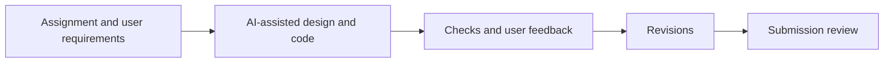

# AI usage record

## Contributions

| Area                   | My contribution                                                                                              | AI assistance                                                                  |
| ---------------------- | ------------------------------------------------------------------------------------------------------------ | ------------------------------------------------------------------------------ |
| Scope                  | Supplied the assignment and directed features step by step                                                   | Interpreted requirements and proposed implementation approaches                |
| Technology             | Requested React/TypeScript and selected SQLite as the database                                               | Implemented the stack, persistence and database integration                    |
| Design                 | Provided requirements, priorities and feedback throughout development                                        | Assisted with architecture, workflows and technical design decisions           |
| Admin and policy pages | Requested fixes to the admin experience and the ability to create, edit and remove routing rules             | Implemented policy editing, testing, previews and activation controls          |
| Account authority      | Required one admin with authority to create operators and insurers; requested keeping existing demo accounts | Implemented role checks, account creation and persistent access controls       |
| Themes and UI          | Requested distinct role themes, page styling and clearer layouts                                             | Implemented operator, insurer and admin themes and responsive UI improvements  |
| Department display     | Reported the department rename issue and requested clearer current and historical counts                     | Updated the chart to show active departments and dim retired departments       |
| Testing                | Requested testing as part of the feature improvements                                                        | Generated and ran automated checks and revised implementation based on results |
| Monitoring             | Requested monitoring through logs to help investigate problems                                               | Implemented request logging, monitoring signals and related checks             |
| Delivery               | Requested usage guides, documentation cleanup and repository submission                                      | Drafted documentation and assisted with local checks and Git workflows         |

- My contributions covered technology selection, feature direction, usability feedback and requested testing/monitoring.
- AI assistance included design, coding, testing and documentation.
- AI-generated code and explanations still require review and understanding by the submitter.

## Revisions made during development

| Earlier approach or issue                         | Resulting change                                             | Reason                                               |
| ------------------------------------------------- | ------------------------------------------------------------ | ---------------------------------------------------- |
| Basic weight-band configuration                   | Ordered conditions and a final catch-all                     | Support new routing needs without editing core logic |
| Policy impact was visible but editing was unclear | Structured editor, parcel tester and activation controls     | Make rule changes usable and reviewable              |
| Batch validation lacked a complete review flow    | Preview, optional partial import and row error reports       | Explain outcomes before saving                       |
| Department rename left the chart confusing        | Active zero-count departments and dimmed retired departments | Preserve history while showing current policy        |
| Shared demo roles were insufficient               | Admin-created named staff accounts                           | Support multiple users and controlled access         |
| Full-history impact work could grow               | Preview bounded to the latest 5,000 inputs                   | Limit blocking; make sample limits explicit          |

## Verification and limits

- Automated checks cover routing boundaries, imports, permissions and workflow regressions.
- Test code and documentation were also AI-assisted; their existence is not independent proof of correctness.
- Review expected results against the original [assignment](ASSIGNMENT.md).
- Do not claim an independent security audit, completed public deployment or successful CodeQL scan without evidence.
- See [Operations](OPERATIONS.md) for the recorded CI result and remaining deployment work.

## Explain before submitting

- Why exact decimals are used for weight and value.
- How rule priority, the catch-all and insurance checks interact.
- How transactions and retry keys prevent duplicate intake.
- Why historical decisions remain unchanged after policy updates.
- Why SQLite and process-local rate limits constrain scaling.
