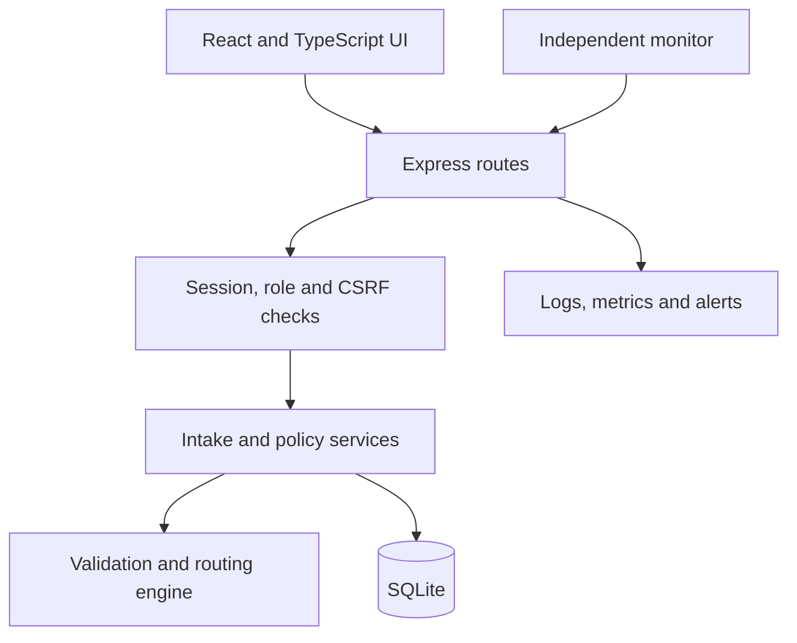
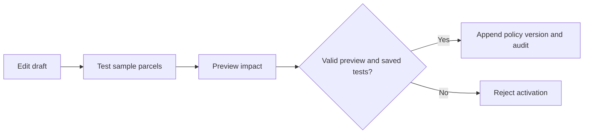

# Architecture

## System map



## Responsibilities

| Location               | Responsibility                                     |
| ---------------------- | -------------------------------------------------- |
| `client/src/views/`    | Dashboard, parcels, batches, policies and accounts |
| `client/src/policy/`   | Rule editor and parcel tester                      |
| `server/routes/`       | Request contracts and authorization                |
| `server/domain.ts`     | Pure validation and routing decisions              |
| `server/imports.ts`    | Bounded JSON/XML parsing                           |
| `server/services/`     | Transactional intake, CSV and observability        |
| `server/repositories/` | Account and parcel SQL                             |
| `server/migrations.ts` | Versioned schema upgrades                          |
| `shared/types.ts`      | Compile-time client/server contracts               |

## Main design decisions

| Choice                         | Benefit                                    | Trade-off                                              |
| ------------------------------ | ------------------------------------------ | ------------------------------------------------------ |
| React + TypeScript             | Reusable views and typed contracts         | Runtime validation is still required                   |
| Express modules                | Clear HTTP and business-logic boundaries   | One process handles requests and bounded database work |
| SQLite                         | Simple setup and transactional persistence | Synchronous access; not a distributed database         |
| Decimal strings + `decimal.js` | Exact boundary comparisons                 | Requires normalization at input boundaries             |
| Ordered declarative rules      | New conditions through configuration       | New field families need validator/evaluator changes    |
| Stored policy versions         | Reproduce past decisions                   | Policy changes do not reroute history                  |
| Actor-scoped retry receipts    | Recover successful intake safely           | A new operation key creates a new operation            |

## Routing engine

- Evaluate rules in ascending priority; first matching rule wins.
- Conditions within one rule use **AND**.
- Require unique rule IDs/priorities and one final unconditional catch-all.
- Support weight/value comparisons, country membership and typed attribute equality.
- Select the proposed department, then independently check insurance.
- Insurance threshold cannot exceed €1000; only an insurer can release a hold.
- Accept legacy policies at the boundary and convert them for the editor.
- Never execute uploaded expressions as code.

## Intake and retry flow

```mermaid
sequenceDiagram
    participant UI as Operator UI
    participant API as Express
    participant DB as SQLite
    UI->>API: Preview file and options
    API-->>UI: Counts, errors and preview token
    UI->>API: Confirm with token and operation key
    API->>DB: Begin transaction; check retry receipt
    alt Existing successful operation
        DB-->>API: Saved response
    else New operation
        API->>DB: Save parcels, batch, audit and receipt
        API->>DB: Commit together
    end
    API-->>UI: Batch result
```

- Atomic mode: any invalid row prevents all inserts.
- Partial mode: explicit opt-in plus preview; save valid rows and rejected-row reasons.
- Preview binds file content, options and policy version.
- Successful retries use the stored receipt even after a later policy change.
- Duplicate source rows remain separate parcels; this is not content deduplication.

## Policy activation



- Compare at most the latest 5,000 stored inputs in a read transaction.
- Bind preview to normalized rules, active version and latest parcel ID.
- Recheck preview and saved tests inside the activation transaction.
- Require an activation reason of at least ten characters.
- Rollback appends a new version; it does not delete old versions.
- Example: Mail → Whale shows Whale at zero and Mail as retired; new parcels use Whale.

## Identity and UI

- One admin enforced by a database constraint.
- Admin creates operator/insurer accounts and can disable staff.
- Password changes and disabling revoke sessions.
- React themes: operator blue, insurer teal, admin violet.
- Colors do not grant access; server role checks do.
- XML name/city retention is opt-in; street addresses are not retained.

## Limits and extension points

- Single-process account cache and rate limits need redesign for multiple instances.
- Add workers and a shared transactional store for larger workloads.
- Real carrier delivery needs an outbox and consumer deduplication.
- Impact previews are samples, not full-history guarantees.
- New attribute rules need configuration; new predicate families need implementation and tests.
- See [Operations](OPERATIONS.md) for monitoring and recovery.
