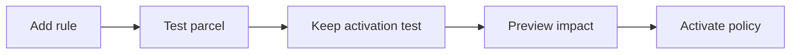

# Feature walkthrough

## 1. Start and create staff

```sh
npm ci
npm run dev
```

- Use Node 24; open <http://127.0.0.1:5173>.
- Sign in with initial demo account `admin / Demo-admin-2026!`.
- In **Account & access**, create an operator and an insurer with passwords of 12–128 characters.
- Use those credentials when switching roles below.
- For repeatable totals, use a fresh database and default policy.
- Optional: set `DATABASE=data/exploration.sqlite3` in `.env` before starting; use a new filename to preserve existing data.

## 2. Import the main sample

1. Sign in as operator; open **Import a batch**.
2. Select [explore-batch.json](../examples/explore-batch.json).
3. Leave partial import unchecked; click **1. Preview import**.
4. Expect **12 valid, 0 rejected; 8 routed, 4 insurance holds**.
5. Click **2. Confirm import** once.
6. Open **Batches & results** and download the results CSV.

| Department | Proposed, including holds | Initially routed |
| ---------- | ------------------------- | ---------------- |
| Mail       | 3                         | 2                |
| Regular    | 4                         | 3                |
| Heavy      | 5                         | 3                |

- Holds appear in the distribution only after approval.
- A new upload creates a new batch; a retry with the same operation key recovers the previous result.

## 3. Inspect and enter parcels

- Open **All parcels**; search for `EXPLORE-08`.
- Try status, country, department, date and batch filters; click **Apply filters**.
- Change oldest/newest sorting and export filtered results.
- Open **New parcel**; enter weight `10`, value `1000.01`, country `NL`.
- Expect **Regular proposed / awaiting insurance**.
- Repeat with value `1000`: expect immediate routing.
- Use JSON or the policy tester for attributes; the single-parcel form does not expose arbitrary attributes.

## 4. Compare import modes

1. Select [explore-partial-import.json](../examples/explore-partial-import.json).
2. Preview with partial mode off: **2 valid, 3 invalid**; rows 2, 4 and 5 fail.
3. Confirm stays disabled; no records are saved.
4. Enable **Import valid rows even if some rows fail**.
5. Preview again and confirm: two accepted rows, one routed and one held.
6. Download rejected-row reasons from **Batches & results**.

- XML alternative: [assignment file](../examples/Container_68465468.xml).
- Confirm `NL` as fallback country before importing XML.
- Default result: **17 parcels, 11 routed, 6 holds**.
- Recipient name/city retention is optional and off by default.

## 5. Review insurance

1. Sign in as insurer; open **Insurance queue**.
2. Review `EXPLORE-08`; approve with a reason.
3. Confirm it becomes routed to Mail.
4. Reject `EXPLORE-09` with a reason.
5. Confirm it leaves the queue but does not increase routed counts.

- Each pending parcel can be decided once.
- Admin and operator cannot approve insurance.

## 6. Create and activate a rule



1. Sign in as admin; open **Routing policy**.
2. Click **Add rule**; use ID `fragile-special`, department `Special`, priority `0`.
3. Keep condition `attributes.fragile eq true`; existing priorities shift up.
4. Test weight `12`, value `1200`, country `IN`, Fragile checked.
5. Expect **Special / pending_insurance**; verify the result before keeping it as an activation test.
6. Enter a reason of at least ten characters.
7. Preview impact, review differences, then activate.
8. Submit a new fragile parcel through JSON to see the new rule.

- Existing parcel decisions remain unchanged.
- Try changing Special to Other while retaining the expected Special test: activation should be blocked.
- Restore the intended rule; do not remove a useful test just to bypass a failure.
- Advanced JSON requires **Load JSON into editor** before preview.

## 7. Try other policy changes

| Change           | Steps / expected behavior                                                  |
| ---------------- | -------------------------------------------------------------------------- |
| Country override | Add `country in IN` before weight rules; choose Customs                    |
| Bulky department | Add `weight lte 30` between Regular and Heavy; test 10, 10.001, 30, 30.001 |
| Mail → Whale     | Rename and activate; Whale appears at zero, historical Mail is dimmed      |
| New Whale parcel | Submit weight 0.5, value 20, country NL; Whale count increases             |
| Rollback         | Load an older version, preview and activate; a new version is added        |

- Keep one final unconditional catch-all.
- Smaller priorities run first; conditions within a rule are ANDed.
- Insurance threshold cannot exceed €1000.
- Preview uses the latest 5,000 inputs at most.

## 8. Accounts, audit and mobile

- Create a temporary operator; sign in and check its access.
- Disable that account as admin; its sessions are revoked.
- Change a temporary account password; it signs out all its sessions.
- Open **Audit trail** as admin; inspect actor, reason and request ID.
- Resize the browser to about 390px; check navigation, dialogs and table scrolling.
- Observe blue operator, teal insurer and violet admin themes.

## 9. Developer evidence

- Run the commands in the [README](../README.md#developer-checks).
- Use [Operations](OPERATIONS.md) for metrics, backup and alert checks.
- Small demo samples will not trigger every anomaly threshold.
- Automated checks do not replace reviewing the assignment's expected behavior.
