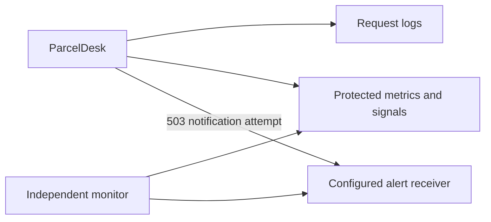

# Operations

## Local setup

- Require Node 24; run `npm ci` then `npm run dev`.
- Frontend: <http://127.0.0.1:5173>; API: port 8081.
- Built demo: `npm run build` then `npm run start:demo`; open port 8081.
- Fresh demo creates only `admin / Demo-admin-2026!`.
- Staff accounts and changed passwords persist in SQLite.

## Configuration

| Setting         | Purpose                                                                |
| --------------- | ---------------------------------------------------------------------- |
| `DATABASE`      | SQLite path; demo default `data/demo-ts.sqlite3`                       |
| `PORT` / `HOST` | Server listener settings                                               |
| `ROUTING_USERS` | Production bootstrap credentials with scrypt hashes; exactly one admin |
| `TRUSTED_HOSTS` | Allowed hostnames                                                      |
| `TRUST_PROXY`   | Explicit trusted proxy scope; avoid trusting arbitrary clients         |
| `MONITOR_TOKEN` | Random token of at least 32 characters                                 |
| `MONITOR_URL`   | Monitor target                                                         |
| `ALERT_WEBHOOK` | Optional HTTPS alert receiver                                          |
| `DOMAIN`        | Production Caddy domain                                                |

- Dev/start commands load optional `.env`; the monitor command does not automatically load it.
- Generate bootstrap hashes with `npm run users --silent`; protect generated credentials.
- Startup bootstraps the sole administrator; create staff through **Account & access**.
- Never commit real credentials or generated user files.
- Production database default: `data/routing-ts.sqlite3`.

## Production setup

1. Install locked dependencies with `npm ci`; run `npm run build`.
2. Configure real credentials, trusted hosts and protected database storage.
3. Configure HTTPS; production session cookies require secure transport.
4. Start with `npm start`, or configure `DOMAIN` and credentials then run `docker compose up --build -d`.
5. Verify login, intake, insurance review, backup and alerts in that environment.

- Intended for one Node process.
- Runtime Docker image launches Node directly; npm/Yarn are removed from that stage.
- Public hosting, real TLS/DNS and live disaster recovery are deployment tasks, not completed claims.

## Monitoring



| Endpoint       | Access / scope                                                |
| -------------- | ------------------------------------------------------------- |
| `/healthz`     | Public process check                                          |
| `/readyz`      | Public database read check; does not prove write availability |
| `/metrics`     | Bearer monitor token; counts, HTTP counters and durations     |
| `/api/monitor` | Bearer monitor token; signals and recent alerts               |

- Use `Authorization: Bearer <MONITOR_TOKEN>`; never place tokens in URLs.
- Monitor token cannot access parcel records or perform mutations.
- `npm run monitor -- --once`: one check; `npm run monitor`: one-minute polling.
- Supply monitor environment variables explicitly; use HTTPS for remote targets.
- Counters reset on restart; scrape them for durable time series.
- Logs include request ID, route, method, status, duration, username and role.
- Passwords, tokens, bodies and query strings are omitted from request logs.

### Alert thresholds

| Signal           | Trigger                                                                               |
| ---------------- | ------------------------------------------------------------------------------------- |
| Department share | ≥20 recent-hour parcels, ≥100 preceding-seven-day parcels, ≥25 percentage-point shift |
| Validation spike | ≥10 errors in an hour and more than 3× the prior seven-day hourly average             |
| Policy impact    | Changed decisions for ≥25% of a sample of at least 10 inputs                          |
| Backlog          | Overview shows old insurance holds and pending inventory                              |

- Department baseline excludes the latest hour; insufficient data does not prove health.
- Policy sample is capped at the latest 5,000 inputs.
- Direct 503 webhook: five-second timeout, one in-flight request, one-minute suppression.
- Webhook delivery is not a durable queue; use an independently supervised monitor.
- Without a configured webhook, monitor notifications remain console output.

## Backup, migration and recovery

```sh
npm run backup -- data/demo-ts.sqlite3 /protected/path/new-backup.sqlite3
```

- Backup uses SQLite's online API and an integrity check.
- Do not copy only the main database while WAL is active; never delete an active WAL to fix contention.
- Store backups securely and rehearse restoration.
- Restore: stop writes → preserve old files → restore to a new path → set `DATABASE` → revoke restored sessions → verify totals, policy and audit → resume.
- Schema upgrades run transactionally using `PRAGMA user_version`.
- Version 3 enforces one admin; reconcile old multi-admin databases before upgrading.
- Retention: alerts 30 days; validation events eight days; parcel/audit history is retained.
- Define separate business-data retention for optional recipient name/city and backups.

## Incident checklist

1. Capture the request ID and check logs/readiness.
2. Inspect original parcel input and stored policy version.
3. Reproduce the result and add a regression before changing behavior.
4. Retry uncertain intake with the same operation key.
5. For policy rollback, load and activate an older policy as a new version.

## Checks and known CI prerequisite

- Main CI: lint, format, build, backend coverage, React tests, browser workflow, benchmark and dependency audit.
- Security workflow: CodeQL, full-history Gitleaks and container Trivy.
- Dependabot checks npm, Actions and Docker dependencies.
- Recorded remote result for commit `55fa457`: application verification, secrets and image checks passed.
- CodeQL was blocked by this private repository's GitHub Code Security setting.
- Repository/organization owner must enable the required feature and confirm subscription requirements.
- That historical result is not a claim that every later commit passed.
- Gitleaks uses a pinned open-source container; exact historical checksum false positives are listed in `.gitleaksignore`.
- Trivy retains its fixable HIGH/CRITICAL failure threshold; no vulnerability exclusions were added.

## Troubleshooting

| Symptom                       | Check / fix                                                    |
| ----------------------------- | -------------------------------------------------------------- |
| `node:sqlite` or engine error | Switch to Node 24; reinstall with `npm ci`                     |
| Missing `package.json`        | Open the repository root in the terminal                       |
| Login screen waits            | Confirm API readiness and both dev processes                   |
| Port already occupied         | Stop the previous instance; avoid concurrent dev/built servers |
| Suspended terminal job        | Resume the relevant job with `fg`; stop with Ctrl+C            |
| Demo password fails           | Use the saved account password; changes persist                |
| XML country missing           | Supply a confirmed two-letter fallback country                 |
| Policy will not activate      | Check saved tests, reason, catch-all and preview freshness     |
| Pushed edits absent from main | Check the pushed branch; a push does not merge it into main    |

## Remaining deployment work

- Test real alerts, recovery, TLS and access controls.
- Arrange independent security review and consider MFA/SSO.
- Protect central logs and define retention/load objectives.
- Add shared identity/rate limiting before running multiple instances.
- Move large workloads to workers and a suitable shared database.
